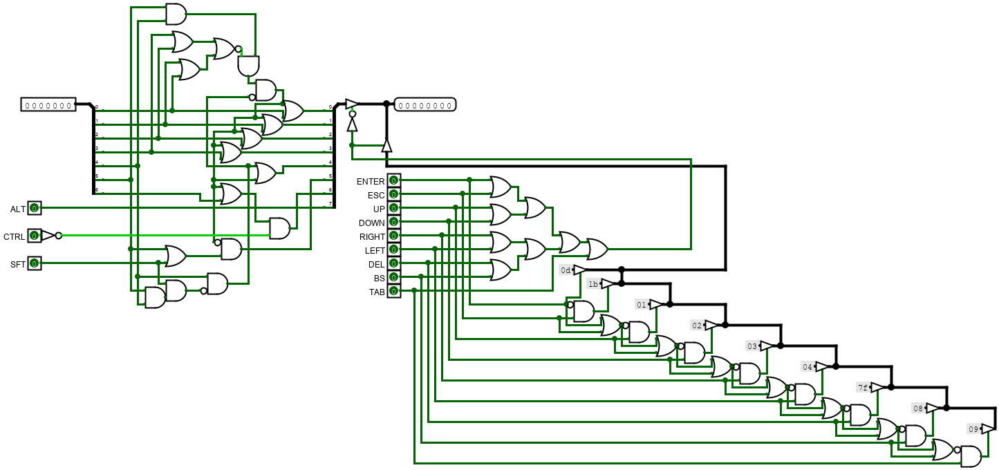

# **Saphyr I Manual**

TO-DO: update

--------------------

> **Attention ! This document is not the final version !**

--------------------

>Version 1.1
>
> Published by
>
>████████
>
>██████
>
>███████████
>
> **Copyright © 197X Safyrus Industry**, All Rights Reserved. Reproduction without express permission is prohibited.

--------------------

&nbsp;

## **Contents**

1. [Introduction](#I--Introduction)
    1. [Acknowledgments](#1--Acknowledgments)
    2. [Goal of this manual](#2--Goal-of-this-manual)
    3. [What is a "SAPHYR I"?](#3--What-is-a-"SAPHYR-I"?)
        1. [General information](#a--General-information)
        2. [Difference between models](#b--Difference-between-models)
    4. [Installation](#4--Installation)
2. [Operating the SAPHYR I](#II--Operating-the-SAPHYR-I)
    1. [Computer Interface](#1--Computer-Interface)
    2. [First Start-up](#2--First-Start-up)
    3. [Basic commands](#3--Basic-commands)
    4. [Default programs](#4-Default-programs)
        1. [DEBUG](#a--DEBUG)
        2. [PROG](#b--PROG)
    5. [Some software](#5--Some-software)
        1. [SAPHYR DOS](#a--SAHYR-DOS)
3. [Programming with the SASM language](#III-Programming-with-the-SASM-language)
    1. [Basic organization of a program](#1--Basic-organization-of-a-program)
        1. [Instruction](#a--Instruction)
        2. [Comments](#b--Comments)
    2. [Registers](#2--Registers)
        1. [Registers](#a--Registers)
        2. [Flags](#b--Flags)
    3. [SASM Instructions](#3--SASM-Instructions)
        1. [Control](#a--Control)
        2. [Arithmetic](#b--Arithmetic)
        3. [Logic](#c--Logic)
        4. [Branch](#d--Branch)
        5. [Memory manipulation](#e--Memory-manipulation)
    4. [Branch instructions](#4--Branch-instructions)
        1. [Label](#a--Label)
        2. [Basic jump](#b--Basic-jump)
        3. [Conditional jump](#c--Conditional-jump)
    5. [Data notation](#5--Data-notation)
        1. [Hexadecimal](#a--Hexadecimal)
        2. [Decimal](#b--Decimal)
        3. [Binary](#c--Binary)
        4. [Char](#d--Char)
        5. [String](#e--String)
        6. [Label high/low address](#f--Label-high/low-address)
    6. [Compilation instructions](#6--Compilation-instructions)
        1. [Import](#a--Import)
        2. [Origin](#b--Origin)
        3. [Const](#c--Const)
        4. [Extern](#d--Extern)
    7. [Programming tips](#7--Programming-tips)
        1. [Shortcut instruction](#a--Shortcut-instruction)
        2. [Useful default functions, routines and subroutines](#b--Useful-default-functions,-routines-and-subroutines)
        3. [Some programming conventions](#c--Some-programming-conventions)
4. [The different devices](#IV--The-different-devices)
    1. [the Keyboard](#1--the-Keyboard)
    2. [the RAM and the ROM](#2--the-RAM-and-the-ROM)
    3. [The hardware states](#3--The-hardware-states)
    4. [the Screen](#4--the-Screen)
        1. [Modes](#a--Modes)
        2. [VPU](#b--VPU)
    5. [The Input/Output](#5--The-Input/Output)
    6. [The floppy drive](#6--The-floppy-drive)
    7. [The EXT connection](#7--The-EXT-connection)
5. [Hardware specifications](#V--Hardware-specifications)
    1. [SAPHYR I architecture]()
    2. [S257-01 (CPU)]()
        1. [Chip pins]()
        2. [Simplify view of the internal Architecture]()
    3. [HWSTATS (Hardware States)]()
        1. [Registers]()
    4. [S400-4K (Rom 4K)]()
        1. [Specification]()
        2. [Chip pins]()
    5. [S400-2K (Rom 2K)]()
        1. [Specification]()
        2. [Chip pins]()
    6. [S300-1K (Ram 1K)]()
        1. [Specification]()
        2. [Chip pins]()
    7. [S300-16K (Ram 16K)]()
        1. [Specification]()
        2. [Chip pins]()
    8. [S301-8K (VRAM 8K)]()
        1. [Specification]()
        2. [Chip pins]()
    9. [VPU (Video Processing Unit)]()
        1. [Architecture]()
        2. [Registers]()
    10. [EXT (EXTention connector)]()
        1. [Connector Pins]()
    11. [FDC (Floppy Disk Controller)]()
        1. [Registers]()
    12. [FDD (Floppy Disk Drive)]()
        1. [Diagram]()
        2. [Control and state]()
    13. [IOCTRL (Input Output Controller)]()
        1. [Architecture]()
        2. [Registers]()
        3. [DIN Connecter pins]()
        4. [Protocol]()
    14. [Keyboard]()
        1. [Key code to ASCII]()
        2. [Signals]()
    15. [Screen]()
6. [Appendix](#VI--Appendix)
    1. [Binary](#1--Binary)
        1. [Description](#a--Description)
        2. [Logical operations](#b--Logical-operations)
    2. [Hexadecimal](#2--Hexadecimal)
    3. [Some programs](#3--Some-programs)
        1. [Random screen]()
        2. [Keyboard reading]()
        3. [Sound Pattern]()
        4. [Write to the floppy]()
        5. [Read from the Floppy]()
        6. [Moving line]()
    4. [Instructions set](#4--Instructions-set)
    5. [Memory map](#5--Memory-map)
    6. [SAPHYR I ASCII](#6--SAPHYR-I-ASCII)
    7. [Safyrus Industry Naming Convention (SINC)]()
    8. [Palette](#7--Palette)
    9. [Pix46 Font](#8--Pix46-Font)

&nbsp;

&nbsp;

--------------------

## **I- Introduction**

### 1- Acknowledgments

The name _"SAPHYR I"_ is a registered trademark with regard to any computer product, and is owned by _"Safyrus Industry"_.
Programs in this document are made and own by _"Safyrus Industry"_ and can be used freely for personal and education purposed but CAN NOT be used for any lucrative purpose.
This manual and his content are made and own by _"Safyrus Industry"_ and cannot be resold or use for any lucrative purpose.

Special thanks are due for M. Alas Diablo for the valuable assistance provided in regard to the _"SAPHYR I"_ final design and final testing.

&nbsp;

### 2- Goal of this manual

Hello! And **thank you!** Thank you for your purchase of the **SAPHYR I** computer.
This manual will teach you how to use your new possession and all there is to know about it. You don’t need to know what a "computer" is or any prior knowledge to learn how to use the SAPHYR I because this manual will (we hope!) explains the very basics of computers and what to do with them. By the end, you should know how to do useful and fun stuff with the SAPHYR I and have an understanding of how computer works.

The manual that you are actually reading is composed of multiple chapters represent by roman number. You are actually in the first chapter named Introduction that will tell you general information about your computer and how to install it.
Chapter II will show you how to perform basic action on your machine.
Chapter III will teach you how to make basic programs (don’t worry for now if you don’t know what it is) in the SASM programming language (again don’t worry).
Chapter IV is design for learning about the different devices inside and outside the machine and how to use them.
Chapter V will explain in great detail each component of the computer. You don’t need to read this chapter if you are not an engineer, or you don’t intend to modify, or make very advance and complex things with the SAPHYR I.
Chapter VI contain additional information and resources.

&nbsp;

### 3- What is a "SAPHYR I"?

#### _a- General information_

We think that you have figure out that "SAPHYR I" is the name of the computer next to you.
But what is a computer? Basically, a computer is an electronic machine that is capable of performing a lot of operations on numbers.
For example, The SAPHYR I can do 1 000 000 operations per second!

The SAPHYR I come in 3 main parts:

- The main case, also call "the computer"
- The keyboard
- The CRT monitor screen

The computer is where all the operations occur, that dictate to other devices how to operate.
The keyboard is used to interface with the SAPHYR I.
You can tell to the computer commands to execute by tipping with the keyboard.
The screen is used to communicate information visually to the user.

<u>About the screen:</u>

The screen may not be in your package if you have purchased a "ESSENTIAL" model (see next section for the difference between models).
If you have a CRT television that can change his horizontal and vertical frequency then you can use it as a screen.
WARNING! WE ARE NOT RESPONSIBLE FOR ANY DETERIORATION OF YOUR TV IF YOU USE IT INCORRECTLY WITH THE SAPHYR I.

#### _b- Difference between models_

Contrary to other computer producers, we do not have "fix" model types, but we have 3 "official" and a "custom" model.
The 3 "official" models are "ESSENTIAL", "BASIC" and "COMPLETE".
The difference between each is described in the table below.
The "custom" model is quite special, and is made to answer for the need of everyone.
You can choose what devices you want in your SAPHYR I to make it correspond to your need (note: due to hardware and production limitation, there is a small upfront cost to order a custom SAPHYR I but can result in a cheaper price than another official model depending on your configuration).
If you have ordered a custom configuration, you can note his configuration in the table below:

|Models |ESSENTIAL|BASIC|COMPLETE|YOUR CONFIG|
|-------|:-------:|:---:|:------:|:---------:|
|ROM 4K |    X    |  X  |   X    |           |
|ROM 2K |         |  ?  |   X    |           |
|RAM 1K |    X    |  X  |   X    |           |
|RAM 16K|         |     |   X    |           |
|VRAM 8K|         |  X  |   X    |           |
|VPU    |         |  X  |   X    |           |
|IOCTRL |         |  X  |   X    |           |
|FDD    |         |     |   X    |           |
|FDC    |         |     |   X    |           |
|EXT    |    X    |  X  |   X    |           |

Table I 1: The different types of models

&nbsp;

### 4- Installation

The installation of the SAPHYR I is not a very complex process but need to be performed with a lot of attention.
WARNING! WE ARE NOT RESPONSIBLE FOR ANY IMPROPER USE OR UNFOLLOW INSTRUCTIONS THAT MAY RESULT IN THE DETERIORATION OR DESTRUCTION OF THE MATERIAL.

Figure I 1: Front of the computer

Figure I 2: Back of the computer

Figure I 3: Back of the screen

Figure I 4: Back of the keyboard

Steps to follow:

  1. Make sure that the PWR button on the front of the computer is not pushed.
  If it is the case, just pressed it, and it will go back to its original position.
  2. Connect the main power cable in the POWER plug on the back of the computer and in a standard grounded electrical outlet.
  **DO NOT** ATTEMPT TO PLUG THE CORD INTO A TWO-HOLE (UNGROUNDED) OUTLET. DO NOT ATTEMPT TO REMOVE THE GROUND PRONG.
  3. Connect the device cable in the "PORT" hole on the back of the keyboard and in the port label "1" on the front of the computer.
  (other port will work, but some program may only check for a keyboard in port 1)
  4. Connect the power cable of the screen in the POWER hole on the back of the screen and in a 120V, 60Hz grounded power outlet.
  AGAIN, **DO NOT** PLUG IT IN A TWO-HOLE OUTLET.
  5. Connect the video cable in the VIDEO hole on the back of the computer and in the VIDEO hole on the back of the screen.
  
<u>Tips:</u> you can put the screen on top of the computer (its strong enough to support the weight of the screen) and the keyboard in front of the computer for a better use.

&nbsp;

&nbsp;

--------------------

## **II- Operating the SAPHYR I**

### 1- Computer Interface

After the installation process. It is now the time to power the computer on. But how exactly? Well, let’s first take a look at the numerous buttons and other interfaces.

Figure II 1: Different interfaces on the front of the computer

The most important button is the PWR button in the top left. It will, when push back, power the computer and allow it to start. You can know when the computer is powered when the green light below the PWR button turn on. The other button called the RST button will reset the computer at its initial state.

The 8 connectors at the bottom are used to connect multiple devices that can be used to send information to the computer or receive information from it. These connectors are now as "the IO ports" and are labels from 1 to 8.

There is a 5.25inch floppy disk drive in the middle and is used to insert floppy disk in the computer to read or write data on them.

And finally, in the top center there is the "EXT port" (EXT stand for Extended) that can be used to plug anything with the same interface and extend the capability of the computer.

&nbsp;

### 2- First Start-up

Now that we know the interface of the computer, let’s power it on by pressing the PWR button. If installed correctly, the green light below the button will turn on and the screen will display an image like the one below.

(_If it is not the case, then you have maybe inserted a floppy or an EXT device with a program that the computer will run, or you have failed the installation process, or the computer may have a part that is not working properly._)

Figure II 2: First screen showing when starting the computer

The computer is trying to tell you something on the screen! Let’s read the first line of text!

>NO BOOTABLE MEDIA FOUND

Ah, yes. The computer is telling you that it has not found a device, like a floppy disk, that is "bootable". But what does that mean? Let’s explain what the computer is trying to do when power up:

- First it checks if the necessary component to start are present in the computer.
- Then it tries to find a bootable device. By bootable it means a device or a program that the computer can give the control to.
- If it does not find one then it will display a message on the screen to tell you and emit a sound in case you don’t have a screen.
- After that, it will enter a state named "PROMPT" mode.

Ok, so the computer has not found something to start, but notice the next sentence:

>ENTERING PROMPT MODE

Now that means that the computer is now in PROMPT mode. That’s a state where you can tell commands to the computer, and it will execute them.

&nbsp;

### 3- Basic commands

You can write any commands when you see a greater than symbol follow by a blinking character known as the cursor. The cursor tells you where on the line the character you type will be printed.

>\>█

You can type any characters and the cursor will move forward accordingly. If you make a mistake, you can erase a character by tapping the BACKSPACE key (the one in the top right with an arrow pointing straight left). When you are in PROMPT mode, you can type 8 characters before the program will not take any more characters. When you want to tell the computer that you have finished typing the command, you can just press ENTER (the big key just below BACKSPACE).

We will now see what command you can type.

- <u>STOP</u>: The STOP command will turn off the computer, simple as that. (it’s just a lazy way to not get up and press the PWR button)
- <u>DEBUG</u>: The DEBUG command will change the current mode to the DEBUG mode. This mode is useful if you want to fix a "bug" (technical term to signify an unwanted behavior) in case your computer can’t boot but should. In most of the case, you will not use this program.
- <u>PROG</u>: The PROG command will change the current mode to the PROG mode. This mode will allow you to enter program directly into the computer. This is where we will learn how to program the Saphyr I.

&nbsp;

### 4- Default programs

#### _a- DEBUG_

The DEBUG mode will take an 8 character long hexadecimal value that will be executed as an instruction. For Example:

Figure II 3: Screen showing the DEBUG mode

Here we have entered the value "040E2500" which is the hexadecimal code for the instruction "MOV $G4 25" (you can know the code for each instruction by referring to the Instruction set section of the Appendix chapter). After pressing enter, the computer has executed this instruction and placed the hexadecimal value 25 (37 in decimal) into the G4 register.

Be aware that the executed instruction will be followed by others from the DEBUG program and the result of your instruction may be overwritten.

#### _b- PROG_

The PROG program will take an instruction in the SASM language (we will learn this in the next chapter) and will store it to be executed later. The program can save up to 123 instructions. Due to the program needed to run on a minimum hardware, it is not able to understand the whole SASM language, but the minimum needed to enter any program. It can only recognize basic instruction with argument that are a hexadecimal value or a register.

Figure II 4: Screen showing the PROG mode

This program is very strict on the syntax. Imagine that the text you enter is divide into 4 boxes with 4 characters for each box. Each instruction or argument must fit into one box. So, if you have an argument "$A", the next argument must be separated with 2 space to add up to 4 characters.

    +---+---+---+---++---+---+---+---++---+---+---+---++---+---+---+---+
    [ A | D | D |   || $ | A |   |   || $ | G | 0 |   || C | 4 |   |   ]
    +---+---+---+---++---+---+---+---++---+---+---+---++---+---+---+---+

Figure II 5: Spacing of characters for the PROG program

The program adds two new instruction to interact with your instructions.

- GO: Each time you enter an instructions, a cursor that retains at which line you’re at increment. And to go back (or forward) you can use the GO instruction. It takes two number that make an address that will be the new cursor location (your program starts at address 1A10 and each instruction take 4 bytes. So, if you want to go to line 10 you need to GO to address 1A10+0A*4=1A38)
- RUN: execute your program from the first line and return to the prog program when your program has finished its execution.

&nbsp;

### 5- Some software

#### a- SAPHYR DOS

_**TODO**_

&nbsp;

&nbsp;

--------------------

## **III- Programming with the SASM language**

If you want the computer to do what you want, you will need to tell it. But there is one problem, the computer only knows one language: Binary. Binary is only composing of 2 character, 1 and 0 and even if it is technically possible to make an all program with it, it is very hard to read (for example if you have not read 100101 immediately as 37 then this chapter will be very useful). This is why we have invented the SASM (_Saphyr Assembler_, or _Safyrus’s Assembler_) language to write programs.

&nbsp;

### 1- Basic organization of a program

#### _a- Instruction_

A program is mainly composed of multiple instructions. These instructions will be executed one after the other by the computer. You can think of a program as a list of multiple lines, and you write an instruction in each line. We will for now on represented these lines with a number with a period follow by the instruction.

This is what an instruction looks like:

    1. CMP 5 4

This program read as "the line n°1 compare the number 5 with the number 4" and you can see that the line n°1 contain the instruction "CMP" with 2 arguments, the first being "5" and the second "4". We will go through the possible instructions and their argument step by step.

NOTE: numbers in program are written in hexadecimal base by default. If you don’t know what Hexadecimal is, please refer to the hexadecimal part in the Appendix chapter.

#### _b- Comments_

A program can also contain other things than instructions, for example: comments. Comments start with a # and everything after that will be ignored by the computer until a new line start. There are used to make notes for yourself and remember important thing.

Example:

    1. # This is a comment!
    2. CMP 5 4
    3. #This is another comment
    4. #You can also put comments after instructions:
    5. CMP 1 3 #Like this!

The above program will be interpreted as the program below:

    1. CMP 5 4
    2. CMP 1 3

&nbsp;

### 2- Registers

Before we can start writing program, we need to talk a bit about how your computer works under the hood and how register works

#### _a- Registers_

The SAPHYR I have what is called a CPU (Central Processing Unit). This is the most complex part of the computer and can be compared as the brain of the computer. It tells to other component what to do like save a value into memory, print something on the screen, etc. This is the same CPU that will execute the instruction in your program, and it possesses what is known as registers. A register is like a box that can hold a number. There can be used for example to save temporarily numbers for an operation. There are 16 different 8bit (that is 8 characters in binary and can represent 256 value) registers in the CPU.

|   |   |   |   |   |   |   |   |
|:-:|:-:|:-:|:-:|:-:|:-:|:-:|:-:|
| O | A | B | C | D | E | F | R |
|J1 |J2 |G0 |G1 |G2 |G3 |G4 |G5 |

Table III 1: Register names

Some registers are general purpose register, that mean that you can do what you want with them. The principal general registers are A, B, C, D and E. There are also another group of general register named G0, G1, G2, G3, G4 and G5.

Some registers are special, and their value can change depending on their role. For example, the O register will always contain the value 0 no matter what. The register R will contain a random value each time a cycle pass. The registers J1 and J2 will be explained later.

Little explanation about registers names:

- O because it’s like a 0
- A-E because it’s the first letter of the alphabet
- F like Flag
- R like Random
- J like Jump
- G like General

Registers in program will be written as a $ follow by the name of the register:

    1. # Move the hex value 12(18 in decimal)
    2. # in the register A
    3. MOV $A 12

#### _b- Flags_

_NOTE: It is advised but not obligatory to read the binary part of the appendix if you don’t know anything about it before reading this part._

But there is one register know as F that is very special. This register contains "flags" that each have special meaning. These flags can be on (represented by a 1) or off (represented by a 0). The F register will be updated when the instruction "CMP" (compare two number) is used and by consequence will replace any value that was in the register before.

Let’s see the structure of the F register:

|          |   |   |   |   |   |   |   |   |
|:---------|:-:|:-:|:-:|:-:|:-:|:-:|:-:|:-:|
|Position  | 7 | 6 | 5 | 4 | 3 | 2 | 1 | 0 |
|Flag Name |   |   |   |   | L | Z | G | C |

Table III 2: Flags position and name

The register has 4 flags, for their explication we will call the first number of the CMP instruction ‘A’ and the second ‘B’:

- Carry flag (C): is active if A + (not B) + 1 > 255 or in other term if adding A and B is bigger than what a 8bit number can represent. It can also be seen as if A (unsigned) is greater or equal to B (unsigned)
- Greater Flag (G): if A (signed) is greater than B (signed)
- Zero Flag (Z): if A-B = 0 or if A equal B
- Lesser Flag (L): if A (signed) is lesser than B (signed)

&nbsp;

### 3- SASM Instructions

#### _a- Control_

Control instructions are used to control the state of the computer and registers data.

<u>NOP</u>: Do nothing. Can be used to line instructions in memory or to time the execution of other instruction.

<u>RST</u>: Reset the computer.

<u>OFF</u>: Turn off the computer.

<u>MOV</u>: Move/copy a register data or a number into a register. Example:

    1. MOV $A 04 # move the value 4 into the A register
    2. MOV $B $A # move the content of A into B

<u>CMP</u>: Compare two values/registers and update the F register accordingly. The order of the argument is important. Example:

    1. CMP 04 02 # Compare 4 to 2. The F registers greater
    2.           # flag will be on (because 4>2) with the
    3.           # carry flag (because 4+(not 2)+1>255).
    2. MOV $A 03 # Move the value 3 into A.
    3. CMP $A 05 # Compare the value in A to 5.
    4. CMP 05 $A # The result will not be the same because
    5.           # of the order of the arguments.

#### _b- Arithmetic_

Arithmetic instructions are used to do basic math operation on registers.

<u>ADD</u>: Add two values/registers and save the result into a register. Example:

    1. ADD $A 04 05 # Add 4+5 and save the result in A
    2. ADD $B $A 01 # Add 1 and the value of A and save 
    3.              # into B
    4. ADD $C $A $B # Add A+B and save into C

<u>ADC</u>: Add two values/registers and add 1 and save the result into a register. Example:

    1. ADC $A 04 05 # Add 4+5+1 and save the result in A

<u>SUB</u>: Subtract two values/registers and save the result into a register. Example:

    1. SUB $A 09 05 # Subtract 9-5 and save into A
    2. SUB $B 01 02 # 1-2 = FF (-1 if read as a signed 
    3.              # number or 255 if unsigned)

<u>SBB</u>: Subtract two values/registers and also subtract 1 and save the result into a register. Example:

    1. SBB $A 02 01 # Subtract 2-1-1 and save into A

<u>MUL</u>: Multiply two values/registers and save the result into a register. Example:

    1. MUL $A 04 03 # Multiply 4*3 and save into A

<u>DIV</u>: Divide two values/registers and save the quotient into a register. Example:

    1. DIV $A 04 03 # Divide 4/3 and save the quotient 
    2.              # into A.

<u>MOD</u>: Divide two values/registers and save the remainder into a register. This operation is known as a Modulo. Example:

    1. MOD $A 04 03 # Modulo 4 and 3 and save the result 
    2.              # into A.

#### _c- Logic_

Logic instructions are used to do basic logical/binary operation on registers. You can refer to the binary section of the appendix to learn more about logical operation.

<u>AND</u>: Do a logical AND operation with two values/registers and save the result into a register. Example:

    1. AND $A 05 03 # AND 5 with 3, this will result in
    2.              # 1 to be save in A

<u>OR</u>: Do a logical OR operation with two values/registers and save the result into a register. Example:

    1. OR  $A 05 03 # OR 5 with 3, this will result in
    2.              # 7 to be save in A

<u>XOR</u>: Do a logical XOR operation with two values/registers and save the result into a register. Example:

    1. XOR $A 05 03 # XOR 5 with 3, this will result in
    2.              # 6 to be save in A

<u>NOT</u>: There is no explicit NOT operation in the SASM language but you can do one by using an XOR with a value/register and the value FF. Example:

    1. XOR $A 05 FF # NOT 5, this will result in FA
    2.              # to be save in A

#### _d- Branch_

The Saphyr I have only 1 but really useful branch operation, the JMP instruction. This instruction will be talk in detail into the next section.

JMP: Jump to a specific address in the program. The address is given with 2 values/registers. The instruction will jump only if a specific register/value is equal to the F register. Otherwise, the instruction will be ignored. Example:

    1. MOV $F 04
    2. JMP 04 00 10 # jump to instruction n°4 (10 in hex 
    3. # is 16 and because each instruction is 4 bytes 
    4. # long, 16/4 = 4 instruction length) if F=4. 
    5. MOV $A 01
    6. MOV $B 02 # this is instruction n°4, and $A = 0 
    7. # because we have skipped the previous instruction.

#### _e- Memory manipulation_

The next two instructions can manipulate the data in the computer memory.

GET: Get a value from the memory at a specified address and save it into a register. The address is made from two values/registers. Example:

    1. GET $A 00 50 # Get the value at address 0050
    2.              # (80 in decimal) and save it into A
    3. MOV $A 00
    4. MOV $B 50
    5. GET $A $A $B # Same result as before

SET: Set a value to the memory at a specified address and save it into a register. The address is made from two values/registers. Example:

    1. MOV $A 05
    2. SET $A 01 48 # Set the value at address 0148
    3.              # (328 in decimal) to the value in A

&nbsp;

### 4- Branch instructions

A Branch Instruction is used to change where in the program we are. The processor in the computer execute instruction one at a time and in order. But if we want to skip a certain part of the program or go back, we can use a JMP instruction (the only but very useful branch instruction of the Saphyr I)

#### _a- Label_

Because the computer only understands numbers. We need to specified at which address we want to go. But if we do that, and we add further instruction in our program, the JMPs may now be incorrect. To make our program easier to write and more readable, you can use labels.

A Label is used to label a certain line with a certain name. When we will compile (transform the written program into numbers that the computer will understand) our program, each time we encounter this label, it will be replaced by the address that it represented.

Any label is declared as a string of characters with no space follow by a colon. You cannot only declare a label once. You can use any label by writing a colon followed by its name.

Example:

    1. TEST: # We declare a label named TEST, because
    2. :TEST # We are writing the address of this label.
    3. # Note that there’s two values written because an 
    4. # address is 2 bytes

#### _b- Basic jump_

We can now use our labels with our JMPs instructions. A JMP instruction will go to a specific address. Example:

    1.  START:
    2.  MOV $A 01
    3.  JMP $F :END # jump to END
    4.  MOV $A 02
    5.  END:
    6.  # by this point, $A=1 because
    7.  # we have jumped at line 3
    8.  # and have skipped the line n°4
    9.  LOOP:
    10. JMP $F :LOOP # this will block the program
    11. # because we jump at line 10 and line 10 is a jump
    12. # to line 10

Note that when jumping to another address, this will save the next address after the jump in the J1 and J2 register. The J1 register save the higher part of the address and J2 the lower part.

#### _c- Conditional jump_

You may have notice that we used the F register with the JMP instruction in the previous program. It’s because the real power of the JMP instruction is that it can jump or not depending on if the value/register is equal to the F register. That’s mean that the program can take two different paths depending on the state of the program.
For example, this program will add 3 to the A register the number of times present in the B register:

    1.  START:    # Start of the program
    2.  MOV $A 00 # $A=0
    3.  MOV $B 05 # $B=5
    4.  LOOP:     # Start of the loop
    5.   CMP $B 00 # Compare $B to 0 and
    7.             # Update the F register
    8.   AND $F $F 04 # Keep only the Zero flag in $F
    9.   JMP 04 :END  # If $B=0 (if the zero flag is on)
    10.               # then jump to END,
    11.               # otherwise keep going
    12.  SUB $B $B 01 # decrement 1 from $B
    13.  ADD $A $A 03 # add 3 to $A
    14.  JMP $F LOOP  # go back to the start of the LOOP
    15. END:      # end of the program.
    16. # The value of $A is now F(15) and $B is 0

&nbsp;

### 5- Data notation

You are not force to write an instruction at each line. You can also write data. There is a multiple way to write data.

#### _a- Hexadecimal_

A Hexadecimal value is written as a normal number. Example:

    1. # Write the hexadecimal value 12345678(305 419 896)
    2. 12 34 56 78

#### _b- Decimal_

A Decimal value is written as a number precede by a "%". Example:

    1. # Write the value 123
    2. %123
    3. # Remember that each value is 1byte long and so
    4. # you cannot write for example %465

#### _c- Binary_

A binary value is written as a string of 0 and 1 precede by a "~". Example:

    1. # write the value 37
    2. ~100101
    3. # Remember that each value is 1byte long and so
    4. # you cannot write for example ~1010001110011

#### _d- Char_

A char value is written as a character surrounded by simple quote. Each character represents a number that you can know with the SAPHYR I ASCII section of the Appendix. Example:

    1. # write the value of the character ‘A’, which is 41
    2. ‘A’
    3. # You cannot write multiple characters between 
    4. # single quotes

#### _e- String_

A String value is a string of characters surrounded by double quotes. It is an easier way to write multiple characters. A NULL character is added after the end of the string. Example:

    1. # write "TEXT"
    2. "TEXT" # equal to 54 45 58 54 00

#### _f- Label high/low address_

A Label can be written as showed in the Branch Instruction section, but you can also write the higher or lower part of the address. It can be done by writing the label precede by a colon and adding a colon and either the ‘h’ (higher part) or ‘l’ (lower part) character. Example:

    1. # add some data
    2. 01 02 %128 ~01001011
    3. # Declare a label LABEL with the value 0004
    4. LABEL:
    5. # write the lower part of LABEL
    6. :LABEL:l # this is equal to 04
    7. # write the higher part of LABEL
    8. :LABEL:h # this is equal to 00

&nbsp;

#### _6- Compilation instructions_

Some instructions are not really for the CPU but for the program itself. Every instruction of this type starts with a ‘@’.

#### _a- Import_

Say you have written a program on a file, and you want to reuse in a new program, but you don’t want to write it all over again. That’s where the import instruction come into play. It is used to say "copy all the instructions of a certain file into the current one". Example:

    1. # Program "addTwoNumber"
    2. MOV $A 05
    3. MOV $B 07
    4. ADD $C $A $B

    1. # Import the above program, it’s like writing all
    2. # the instructions starting at the import line
    3. @import addTwoNumber
    4. SUB $C $C 03

#### _b- Origin_

This instruction will change the current address when compiling. Example:

    1. # the LABEL1 is at address 0000
    2. LABEL1:
    3. # the LABEL2 is at address 1234 instead of 0000
    4. @origin 1234
    5. LABEL2:

#### _c- Const_

A const (short for constant) is a word that will be replaced by a number that you have choose. Example:

    1. @const FIVE 05
    2. MOV $A FIVE # will be replace by MOV $A 05
    3. MOV $B 07
    4. ADD $C $A $B

#### _d- Extern_

The "extern" instruction can be used to define something without knowing it’s value

    1. @extern PRINT
    2. JMP $F :PRINT # jump to the print function
    3.               # without knowing its address

&nbsp;

### 7- Programming tips

#### _a- Shortcut instruction_

    1. # Move the address ADR in $A and $B
    2. MOV $A :ADR:h
    3. MOV $B :ADR:l
    4. # The instructions above can be written in one line
    5. MOV $A $B :ADR
    6. # This will still be two instructions but
    7. # it is shorter to write.

#### _b- Useful default functions, routines and subroutines_

|                              |Subroutine|Routine|Function|
|:-----------------------------|:-:|:-:|:-:|
|Can do jump                   |   | X | X |
|Can call subroutine           |   | X | X |
|Can call routine              |   |   | X |
|Can call function             |   |   | X |
|Don’t use the stack           | X | X |   |
|Don’t use call variable       | X |   |   |
|Don’t use registers (normally)|   |   | X |

Table III 3: Difference between functions, routines and subroutines

|name               |type       |address|description
|-------------------|-----------|-------|-----------
|FCT_CMD            |Function   |0484   |Let the user type a command and send it to the current mode.
|FCT_DEBUG          |Function   |06C0   |The DEBUG mode that executes raw hex instructions.
|FCT_OPREGVAL       |Function   |0AD4   |
|FCT_PRINT          |Function   |039C   |Print a string (at address $C$D) to the screen.
|FCT_PROG           |Function   |07D8   |The PROG mode that executes basic SASM instructions.
|FCT_PROMPT         |Function   |0738   |The PROMPT mode that chooses what mode to enter.
|FCT_SCROLLUP       |Function   |0628   |Scroll all the characters on the screen one line up.
|FCT_STRTOREG       |Function   |0B2C   |Convert a string ($A$B) to a register index.
|FCT_STRTOVAL       |Function   |0C84   |Convert a string($C$D) to a hexadecimal value.
|RT_ADD16           |Routine    |0304   |Add two 16bits number. ($AB = $AB + $CD)
|RT_CMP16           |Routine    |02E8   |Compare two 16bits number. (CMP $AB $CD)
|RT_CMPSTR          |Routine    |0210   |Compare two string ($A$B and $C$D) and tell if there are the sames. ($A=1 mean yes and $A=0 mean no)
|RT_COPYMEM         |Routine    |034C   |Copy data of size $E from address $AB to the address $CD.
|RT_CURSDEC         |Routine    |0198   |Decrease the cursor variable.
|RT_CURSINC         |Routine    |0154   |Increase the cursor variable.
|RT_DEC16           |Routine    |02C8   |Decrease a 16bits number. ($AB)
|RT_EPILOGUE        |Routine    |00C8   |Epilogue of a function. Return to the address on the stack. (normally the value saved at RT_PROLOGUE)
|RT_HEXTOVAL        |Routine    |01D0   |Convert a char ($A) into a number. (result in $A)
|RT_INC16           |Routine    |02A8   |Increase a 16bits number. ($AB)
|RT_POPABCDE        |Routine    |0124   |Pop all the registers from A to E.
|RT_PROLOGUE        |Routine    |008C   |Prologue of a function. Save VAR_CALL into the stack.
|RT_PUSHABCDE       |Routine    |00F4   |Push all the registers from A to E.
|RT_VSYNC           |Routine    |028C   |Return when the v-sync flag is on.
|RT_WAITKEY         |Routine    |0330   |Return when a key was pressed.
|SRT_ENDSTR_AB      |Subroutine |006C   |$A=0 if the value at $A$B is 0 and a non 0 value otherwise.
|SRT_ENDSTR_CD      |Subroutine |007C   |$A=0 if the value at $C$D is 0 and a non 0 value otherwise.
|SRT_GETCURS        |Subroutine |0014   |Get the cursor position ($AB).
|SRT_POP            |Subroutine |004C   |Pop a value from the stack.
|SRT_PUSH           |Subroutine |002C   |Push a value into the stack.
|SRT_RETURN         |Subroutine |0020   |Return from a subroutine.
|SRT_SETCURS        |Subroutine |0008   |Set the cursor position ($AB).

Table III 4: Default program functions and routines

#### _c- Some programming conventions_

- **Indent you code** to indicate section of code that may loop or is related to a specific task.
- **Add comments** to describe each block of code.
- **Name your labels correctly** to tell, without reading the code, what this section is doing.
- Split your data and code section.

&nbsp;

&nbsp;

--------------------

## **IV- The different devices**

### 1- The Keyboard

The keyboard is the main way to communicate with the computer. You can communicate with the keyboard with a program by using the IO Controller.

It is composed of multiple keys with different colors representing their type. Grey keys are the letters of the alphabet and the space. Green keys are numbers. Yellow key are special characters keys. Blue keys are control keys and send control character to the computer and control the state of the keyboard.

The keyboard possessed two layouts of keys, the main layout or mode is known as the NORMAL mode. This is the layout you see on top of the keys.

Figure IV 1: Normal mode of the keyboard

By maintaining the SHIFT key, you put the keyboard in SHIFT mode. This is another layout with different key. You can see the characters of this layout on the side of the keys.

Figure IV 2: Shift mode of the keyboard

&nbsp;

### _2- The RAM and the ROM_

A memory in a computer is like a big table that contain multiple values unlike registers that can only hold one value. Each cell is in table is known as a memory cell. Each cell has a unique address. You can split a memory in multiple "pages" that represent 256 bytes of data. You can see one example of a page of a memory in the table below.

|   | X0 | X1 | X2 | X3 | X4 | X5 | X6 | X7 | X8 | X9 | XA | XB | XC | XD | XE | XF |
|:--|:--:|:--:|:--:|:--:|:--:|:--:|:--:|:--:|:--:|:--:|:--:|:--:|:--:|:--:|:--:|:--:|
|0X |04|01|60|00|51|06|00|01|01|23|45|67|89|AB|CD|EF|
|1X |54|45|53|54|49|4E|47|00|4E|4F|20|42|4F|54|41|42|
|2X |4C|45|20|4D|45|44|49|41|20|46|4F|55|4E|44|20|B1|
|3X |0A|43|4B|45|43|4B|20|49|46|20|46|4C|4F|50|50|59|
|4X |20|4F|52|20|45|58|54|20|44|45|56|49|43|45|0A|00|
|5X |00|00|00|00|00|00|00|00|00|00|00|00|00|00|00|00|
|6X |53|06|00|60|00|00|00|00|00|00|00|00|00|00|00|00|
|7X |00|00|00|00|00|00|00|00|00|00|00|00|00|00|00|00|
|8X |00|00|00|00|00|00|00|52|00|00|00|00|00|00|00|00|
|9X |00|00|00|00|00|00|05|AA|20|00|00|00|00|00|00|00|
|AX |00|00|FF|FF|FF|10|5A|AA|A2|00|FF|FF|FF|10|00|00|
|BX |00|00|FF|10|FF|FF|FF|FF|FF|FF|FF|10|FF|10|00|00|
|CX |00|00|FF|10|FF|11|11|11|11|11|FF|10|FF|10|00|00|
|DX |00|00|FF|FF|FF|10|00|00|00|00|FF|FF|FF|10|00|00|
|EX |00|00|01|11|11|10|00|00|00|00|01|11|11|10|00|00|
|FX |00|00|00|00|00|00|00|00|00|00|00|00|00|00|00|5A|

Table IV 1: Content of a memory

The RAM stand for Random Access Memory. It is a memory that is really fast and can be access in any order unlike a cassette tape for example. The only problem with RAM is that is content is lost when its power goes out. It is best suited for saving data that is only needed for a short time, and we don’t need to save for a later use.

The ROM, which stand for Read Only Memory, it’s very similar to the RAM, except it cannot be written, but the content is keep even if the power is off.

&nbsp;

### 3- The hardware states

The Hardware states is a set of registers controlling and monitoring the state of each device of the computer. It is divided into 4 sections of 8 bytes.

The first (00 to 07) is the HARDWARE section. You can know what devices are connected to the computer with the register 0. You can also get a sense of time with the register 1 that counts from 0 to 255 for each second that passed. Register 2 control the buzzer.

The second section (08-0F) is the FDC section. It is used to control the Floppy Disk Controller (FDC). The third section (10-17) is dedicated to the IO Controller and the fourth section (18-1F) to the Video Processing Unit (VPU)

&nbsp;

### 4- The Screen

The screen is where you can display visual information using the computer. You can think of an image display by it as a grid if little colored square called "pixels". The maximum number of pixels that the screen can display is 256(width)*256(height). It can also display a maximum number of 16 different colors.

The screen is control by the VPU (Video Processing Unit) and an 8KB RAM called the VRAM. The VRAM is where you send the data to display to the screen and the VPU is used to control how to display the data.

#### _a- Modes_

The VPU can be in 4 different display modes that will change how the data is represented on the screen. These modes are:

- Mode 0 (Black and white mode): display a black and white pixel image of 256*256 pixels
- Mode 1 (Color mode): display a 16 colors pixel image of 128*128 pixels
- Mode 2 (Text mode): display a 16 colors text image of 64*42 characters.
- Mode 3 (Large text mode): display a 16 colors text image of 32*21 characters with each character twice the size.

#### _b- VPU_

You can change the current mode by setting the value of the MODE register of the VPU.

Be aware that you cannot change the value of the VRAM when the Screen is displaying the image. It can only be access during the vertical blanking period (V Blank for short). You can know if the screen is in V Blank with the first bit of the STATE register of the VPU.

&nbsp;

### 5- The Input/Output

Everything you plug into the IO connections is controlled by the IO Controller. It is the interface between IO devices and the computer.

The IO Controller can be access via the hardware state. The first register tells for each bit if a device is connected to the corresponding port. The second register send for each bit to the corresponding device if the "CPU want to talk". The third register get for each device in the corresponding bit if the "Device want to talk".

You can send and receive data from and to device with the IO memory. Each address and the corresponding action are described in the table below:

|Device port|Get |Set |Get Stat|Set Stat|
|:----------|:---|:---|:-------|:-------|
|0|1D00|1D01|1D02|1D03|
|1|1D04|1D05|1D06|1D07|
|2|1D08|1D09|1D0A|1D0B|
|3|1D0C|1D0D|1D0E|1D0F|
|4|1D10|1D11|1D12|1D13|
|5|1D14|1D15|1D16|1D17|
|6|1D18|1D19|1D1A|1D1B|
|7|1D1C|1D1D|1D1E|1D1F|

Table IV 2: Address for each devices

Each device has a "Set" and "Get" buffer of 8 bytes. When you get a value from a device, it is removed from the buffer. When a value is put in the set buffer it will be send and remove afterward. The "Get Stat" and "Set Stat" are two register for each device with the number of values in corresponding buffers.

&nbsp;

### 6- The floppy drive

The floppy disk let you read and write data permanently to a 5.25-inch floppy disk.
The floppy is inserted into the floppy disk drive (FDD). Make sure the lock is up before.
When the floppy is in, push the lock down to keep the floppy in place.
The light next to it is on when the floppy disk is used. Don’t remove the disk when the light is on otherwise your data may be corrupted.

You can see a hole in the disk. This is normal, it is called the Sector Zero Hole and it let the computer find the start of the disk.
Another hole may be present in the top corner and indicate that the disk can be written.
If there is no hole, then the floppy can only be read.
You may also see that the disk is inside a plastic folder. **DON’T REMOVE IT**. It protects the data from dust and other things.

You can’t access the FDD directly. It is accessed by the Floppy Disk Controller (FDC). The CMD register will tell the FDC what to do (the only commands for now are READ and WRITE). The SECTOR register tells what sector to select. The TRACK register tells what track to select. Two other register STATES and CONTROL can be used to access the FDD directly.

&nbsp;

### 7- The EXT connection

The EXT interface is used to plug almost anything compatible to the SAPHYR I to extend his capability. We cannot provide an explanation for each device that exist that use this interface. For that you must refer to the documentation of the manufacture for the device.

&nbsp;

&nbsp;

--------------------

## **V- Hardware specifications**

### 1- SAPHYR I architecture

Figure V 1: Saphyr I architecture

&nbsp;

### 2- S257-01 (CPU)

#### _a- Chip pins_

Figure V 2: S257-01 Chip

- D0 to D7: Data bus.
- A0 to A15: Address bus.
- STP: A high signal tell the CPU to stop.
- CLK IN: Clock signal to feed to the CPU.
- CLK OUT: Clock signal in “cycle”.
- RW: tell if the CPU is reading (low) or writing (high) data.
- RST: A high signal tell the CPU to reset.
- GND: Ground pin
- PWR: Power pin.

#### _b- Simplify view of the internal Architecture_

Figure V 3: S257-01 architecture

&nbsp;

### 3- HWSTATS (Hardware States)

#### _a - Registers_

|Index|Name|Description
|-----|----|-----------
|  0  |CNT |Connected devices (see table below)
|  1  |TIM |Timer (go through 0 to 255 in 1 second and repeat)
|  2  |BUZ |Control the buzzer sound (base frequency 488,28125Hz)
|     |    |Bits: ttttimmm
|     |    |t= time to let the sound play
|     |    |i= invert multiplier
|     |    |m= multiplier of the pitch

Table V 1: Hardware states registers

|Bits   |  7  |  6  |  5  |  4  |  3  |  2  |  1  |  0  |
|-------|-----|-----|-----|-----|-----|-----|-----|-----|
|Device | EXT |IO CTRL|DSK MEM|VRAM 8K|RAM 16K|RAM 1K|ROM 4K|ROM 2K

Table V 2: CNT register flags

&nbsp;

### 4- S400-4K (Rom 4K)

#### _a- Specification_

|Name       |Value
|-----------|-----
|Memory     |4KB (4096 bytes)
|Persistent |Yes
|Readable   |Yes
|Writable   |No
|Access time|< 1 us

Table V 3: S400-4K specification

#### _b- Chip pins_

Figure V 4: S400-4K chip

&nbsp;

### 5- S400-2K (Rom 2K)

#### _a- Specification_

|Name       |Value
|-----------|-----
|Memory     |2KB (2048 bytes)
|Persistent |Yes
|Readable   |Yes
|Writable   |No
|Access time|< 1 us

Table V 4: S400-2K specification

#### _b- Chip pins_

Figure V 5: S400-2K chip

&nbsp;

### 6- S300-1K (Ram 1K)

#### _a- Specification_

|Name       |Value
|-----------|-----
|Memory     |1KB (1024 bytes)
|Persistent |No
|Readable   |Yes
|Writable   |Yes
|Access time|< 1 us

Table V 5: S300-1K specification

#### _b- Chip pins_

Figure V 6: S300-1K chip

&nbsp;

### 7- S300-16K (Ram 16K)

#### _a- Specification_

|Name       |Value
|-----------|-----
|Memory     |16KB (16 384 bytes)
|Persistent |No
|Readable   |Yes
|Writable   |Yes
|Access time|< 1 us

Table V 6: S300-16K specification

#### _b- Chip pins_

Figure V 7: S300-16K chip

&nbsp;

### 8- S301-8K (VRam 8K)

#### _a- Specification_

|Name       |Value
|-----------|-----
|Memory     |8KB (8 192 bytes)
|Persistent |No
|Readable   |Yes
|Writable   |Yes
|Access time|< 1 us

Table V 7: S301-8K specification

#### _b- Chip pins_

Figure V 8: S301-8K chip

&nbsp;

### 9- VPU (Video Processing Unit)

#### _a- Architecture_

Figure V 9: VPU architecture

#### b- Registers

|Index  |Name   |Description
|:-----:|-------|-----------
|   0   |MODE   |Display mode
|       |       |0= Black and white
|       |       |1= Color
|       |       |2= Large Text
|       |       |3= Text
|   1   |STATE  |State of the display
|       |       |Bits: …….V
|       |       |V= Vsync on

Table V 8: VPU registers

&nbsp;

### 10- EXT (EXTention connector)

#### _a- Connector Pins_

Figure V 10: EXT connector

    0-GND   8-D7    16-PWR  24-A7
    1-D0    9-ENA   17-A0   25-A8
    2-D1    10-RW   18-A1   26-A9
    3-D2    11-CLK  19-A2   27-A10
    4-D3    12-RST  20-A3   28-A11
    5-D4    13-x    21-A4   29-A12
    6-D5    14-x    22-A5   30-A13
    7-D6    15-x    23-A6   31-A14

&nbsp;

### 11- FDC (Floppy Disk Controller)

#### _a- Registers_

|Index  |Name   |Description
|:-----:|-------|-----------
|   0   |CMD    |Write: action to the FDC
|       |       |Read: command status
|       |       |Bits: B…CCCC
|       |       |B= Busy if 1
|       |       |C= command
|   1   |DATA   |Data for the command or the result
|   2   |TRACK  |Track index of the FDD
|   3   |SECTOR |Sector index of the FDD
|   4   |STATE  |Read only. Read the states of the FDD
|   5   |CTRL   |Write directly to the FDD

Table V 9: FDC registers

&nbsp;

### 12- FDD (Floppy Disk Drive)

#### _a- Diagram_

Figure V 11: FDD diagram

#### _b- Control and state_

|Index  |Read           |Write              |
|:-----:|---------------|-------------------|
|   0   |Data           |Data               |
|   1   |Write protected|Write protected LED|
|   2   |Track Zero     |Track Zero LED     |
|   3   |Sector Zero    |Sector Zero LED    |
|   4   |Lock push      |Motor              |
|   5   |   \           |Step               |
|   6   |   \           |Step Direction     |
|   7   |   \           |Read Write head    |

Table V 10: FDD read and write

&nbsp;

### 13- IOCTRL (Input Output Controller)

#### _a- Architecture_

Figure V 12: IOCTRL architecture

### _b- Registers_

<u>Hardware State IO registers:</u>

|Index  |Name       |Description
|:-----:|-----------|-----------
|   0   |CON        |Get the devices connected. Each bit is a flag (1=connected else 0). The bit 0 is the flag for Device 1
|   1   |TALK-CPU   |Set a flag for each device to tell them that the CPU want to send data. The bit 0 is the flag for Device 1
|   2   |TALK-DEV   |Get a flag for each device to tell which of them want to send data to the computer. The bit 0 is the flag for Device 1

Table V 11: HWSTATS IO registers

<u>IO Devices registers:</u>

|Index  |Name           |Description
|:-----:|---------------|-----------
|   0   |GET            |Get the data of the device or 0 if not connected
|   1   |SET            |Set the data of the device
|   2   |GET BUF STAT   |Get how many bytes are in the GET buffer
|   3   |SET BUF STAT   |Get how many bytes are in the SET buffer

Table V 12: IO Devices registers

#### _c- DIN Connector pins_

Figure V 13: Device DIN connector pins

    1 : CPU-Talk
    2 : CLK
    3 : DAta
    4 : CONnected
    5 : DEV-Talk

#### _d- Protocol_

<u>Sending and receiving data on the DAT pin:</u>

|CPU Talk   |DEV Talk   |Action     |Description
|:---------:|:---------:|-----------|-----------
|   0       |   0       |NONE       |Nothing is happening
|   0       |   1       |DEV DATA   |The device send data to the computer
|   1       |   0       |CPU DATA   |The computer send data to the device
|   1       |   1       |CPU WAITING |The computer is waiting for the device to be ready to accept data

Table V 13: Device data actions

<u>Standard command for devices:</u>

|Hex|Command|Description
|---|-------|-----------
|08 |ID     |Identify the device. The response must be the code representing the device type

Table V 14: Device commands

<u>Standard devices ID types:</u>

|Hex|Device type    |
|---|---------------|
|00 |NULL           |
|01 |COMPUTER       |
|02 |KEYBOARD       |

Table V 15: Device ID types

&nbsp;

### 14- Keyboard

#### _a- Key code to ASCII_

Figure V 14: Keyboard keys to ASCII

#### _b- Signals_

|In             |Out            |
|---------------|---------------|
|ID command     |02 (Keyboard device type). Take priority over key pressed.
|Key pressed (from the keyboard itself, not the data pin)   |ASCII value
|Other          |Nothing

Figure V 15: Keyboard signals

&nbsp;

### 15- Screen

Spec name       |Value  |Unit   |
|---------------|-------|-------|
|Margins        |No     |       |
|Interlaced     |Yes    |       |
|Color Format   |2:2:2  |R:G:B  |
|Aspect Ratio   |1:1    |       |
|Pixel Clock    |5.25   |MHz    |
|H Total        |320    |Pixels |
|H Pixels       |256    |Pixels |
|H Blank        |64     |Pixels |
|H Front porch  |8      |Pixels |
|H Sync         |24     |Pixels |
|H Back porch   |32     |Pixels |
|H Freq         |16.406 |KHz    |
|H Period       |60.952 |us     |
|V Total        |147.5  |Pixels |
|V Pixels       |128    |Pixels |
|V Blank        |19     |Pixels |
|V Front Porch  |3      |Pixels |
|V Sync         |10     |Pixels |
|V Back Porch   |6      |Pixels |
|V Freq         |111.229|Hz     |
|V Period       |8.99   |Ms     |

Table V 16: Screen specifications

&nbsp;

&nbsp;

--------------------

## **VI- Appendix**

### 1- Binary

#### _a- Description_

The way we count number is call decimal, or base 10 (meaning it has 10 digit), and binary is in base 2 (only 2 digit). Binary digits are made of bits (0 or 1).

So, in binary, 0 and 1 are represented the same way as in decimal. But how do we write 2 with only 1 and 0? Well in the same way when we run out of digit in decimal, we add a new digit in front if the number (…, 7, 8, 9, 10). So, in binary we have 0, 1 and then 10 to represent 2.

|Decimal|Binary |
|:-----:|:-----:|
|   0   |   0   |
|   1   |   1   |
|   2   |   10  |
|   3   |   11  |
|   4   |  100  |
|   5   |  101  |
|   6   |  110  |
|   7   |  111  |
|   8   |  1000 |
|   9   |  1001 |

Table VI 1: Decimal in Binary

#### _b- Logical operations_

Logical operations take one or multiple bits as input and will output a new bit. It works the same way as mathematical operations like + and – but with bits. Each logical operation has a "truth table" describing all the possible input and output.

**NOT**: The NOT operation inverses the bit it is given (meaning 0 become 1 and 1 become 0).

|IN |OUT|
|---|---|
| 0 | 1 |
| 1 | 0 |

Table VI 2: NOT truth table

    Example:        NOT  0101    (=5)
                    ---------
                    =    1010    (=10)

**AND**: the AND operation will take two bits and will output 1 if the first bit AND the second are 1. It output 0 otherwise.

|IN-1|IN-2|OUT|
|----|----|---|
| 0  | 0  | 0 |
| 0  | 1  | 0 |
| 1  | 0  | 0 |
| 1  | 1  | 1 |

Table VI 3: AND truth table

    Example:         0101    (=5)
                AND  0011    (=3)
                ---------
                =    0001    (=1)

**OR**: the OR operation will take two bits and will output 1 if the first bit OR the second bit is 1. It output 0 if none input bits are 1.

|IN-1|IN-2|OUT|
|----|----|---|
| 0  | 0  | 0 |
| 0  | 1  | 1 |
| 1  | 0  | 1 |
| 1  | 1  | 1 |

Table VI 4: OR truth table

    Example:          0101    (=5)
                OR    0011    (=3)
                ---------
                =     0111    (=7)

**XOR**: the XOR (exclusive OR) operation will take two bits and will output 1 if the first bit OR the second bit is 1 BUT not both. It output 0 if the two input bits are the same.

|IN-1|IN-2|OUT|
|----|----|---|
| 0  | 0  | 0 |
| 0  | 1  | 1 |
| 1  | 0  | 1 |
| 1  | 1  | 0 |

Table VI 5: XOR truth table

    Example:           0101    (=5)
                XOR    0011    (=3)
                ---------
                =      0110    (=6)

&nbsp;

### 2- Hexadecimal

Hexadecimal (base 16) is another way to represent number and is very useful to write binary number in a compact way. There are 16 digits in hexadecimal (or hex for short) and the first tens are normal digits from 0 to 9, but the next digits are in order ‘A’, ‘B’, ‘C’, ‘D’, ‘E’ and ‘F’ (their represents number and not letter).

|Decimal|Hexadecimal|Binary |
|:-----:|:---------:|:-----:|
|   0   |     0     |   0   |
|   1   |     1     |   1   |
|   2   |     2     |   10  |
|   3   |     3     |   11  |
|   4   |     4     |  100  |
|   5   |     5     |  101  |
|   6   |     6     |  110  |
|   7   |     7     |  111  |
|   8   |     8     |  1000 |
|   9   |     9     |  1001 |
|   10  |     A     |  1010 |
|   11  |     B     |  1011 |
|   12  |     C     |  1100 |
|   13  |     D     |  1101 |
|   14  |     E     |  1110 |
|   15  |     F     |  1111 |

Table VI 6: Hexadecimal representation

&nbsp;

### 3- Some programs

#### _a- Random screen_

    # ####################
    # # For the Saphyr I #
    # ####################
    #
    # Fill the VRAM with random value
    # and change VPU mode each time

    # VRAM index
    MOV $A 00
    MOV $B 20

    # VPU mode
    MOV $C 00
    SET $C 1C 18

    SCREEN_FILL:
        # check if vsync on
        GET $D 1C 19
        AND $D $D 01
        CMP $D 00
        AND $F $F 04
        JMP 04 :SCREEN_FILL

        # draw random value
        SET $R $B $A

        ADD $A $A 01
        CMP $A 01
        AND $F $F 01
        JMP 01 :SCREEN_FILL
        ADD $B $B 01
        CMP $B 40
        AND $F $F FE
        JMP 08 :SCREEN_FILL
        MOV $B 20
        SET $C 1C 18
        ADD $C $C 01
        CMP $C 04
        AND $F $F FE
        JMP 08 :SCREEN_FILL
        MOV $C 00
        JMP $F :SCREEN_FILL 

#### _b- Keyboard reading_

    # ####################
    # # For the Saphyr I #
    # ####################
    #
    # Read the keyboard input and put the typed character on the screen.
    # 
    # /!\
    # The Keyboard need to be on port 1 for this program to work.
    # /!\

    # Some constant
    @const UEQ 05
    @const UGE 01
    @const FLC 01

    # Adress for the VPU
    @origin 1C18
    VPU_MODE:
    @origin 1C19
    VPU_STATE:

    # Adresses for IOs
    @origin 1D00
    IO:
    IO1G:
    @origin 1D01
    IO1S:
    @origin 1D02
    IO1GR:
    @origin 1D03
    IO1SR:

    # VRAM adress
    @origin 2000
    VRAM:

    # Start of the program
    @origin 0000
    START:
    # Prepare the VPU
    SET 03 :VPU_MODE
    JMP $F :WAIT_VSYNC
    SET 0F :VRAM:h A1

    START_LOOP:
    # wait for the key
    JMP $F :WAIT_KEY
    # wait for the vsync
    JMP $F :WAIT_VSYNC
    # put the key on the screen
    SET $A :VRAM:h A0
    # loop
    JMP $F :START_LOOP

    # Wait for an input on the
    # first device (which
    # should be the keyboard)
    WAIT_KEY:
    # Save the return adress
    MOV $G0 $J1
    MOV $G1 $J2

    WAIT_KEY_LOOP:
    # Get the keyboard input
    GET $A :IO1G
    # if it is not 0
    CMP $A 01
    AND $F $F FLC
    # then return to the caller
    JMP UGE $G0 $G1
    # else loop
    JMP $F :WAIT_KEY_LOOP

    # Wait for the vertical
    # blanking interval
    WAIT_VSYNC:
    # Save the return adress
    MOV $G0 $J1
    MOV $G1 $J2

    WAIT_VSYNC_LOOP:
    # Get the VPU state
    GET $F :VPU_STATE
    # if it is 0
    AND $F $F 01
    CMP $F 00
    # then loop because it is
    # not vsync
    JMP UEQ :WAIT_VSYNC_LOOP
    # else vsync is on and we
    # return to the caller
    JMP $F $G0 $G1

#### _c- Sound Pattern_

    # ####################
    # # For the Saphyr I #
    # ####################
    #
    # Play a pattern of sound with the buzzer.

    @origin 1C01
    HW_TIMER:
    @origin 1C02
    HW_BUZZER:

    # start
    @origin 0000
    # init C to 0
    MOV $C 00

    MOV $G0 :pattern1:h
    MOV $G1 :pattern1:l
    LOOP:
    # get the next sound
    GET $A $G0 $G1
    AND $B $A F0
    CMP $B 00
    AND $F $F 04
    JMP 00 :PLAY

    CMD:
    AND $B $A 0F
    CMP $B 00
    AND $F $F 04
    JMP 04 :END
    MUL $B $B 10
    GET $A :HW_TIMER
    ADD $D $A $B
    CMD_WAIT:
    GET $A :HW_TIMER
    CMP $A $D
    AND $F $F 04
    JMP 00 :CMD_WAIT
    JMP $F :NEXT

    # play the next sound
    PLAY:
    SET $A :HW_BUZZER
    # inc C
    ADD $C $C 01

    # wait for the sound to end
    WAIT:
    GET $F :HW_BUZZER
    AND $F $F F0
    CMP $F 00
    AND $F $F 04
    JMP 00 :WAIT
    
    NEXT:
    ADD $G1 $G1 01
    CMP $G1 01
    AND $F $F 01
    JMP 01 :LOOP
    ADD $G0 $G0 01
    JMP $F :LOOP

    # the end
    END:
    JMP $F :END

    pattern1:
    19 18 0F
    10 11 12 21 0F
    17 16 15 14 13 12 11 0F
    5B 5A 5B 5A 5B 5A 5B 0 

#### _d- Write to the floppy_

    # ####################
    # # For the Saphyr I #
    # ####################
    #
    # Write sector 0 on track 0 with the FDC.

    # declare some label
    @origin 1C08
    FDC_CMD:
    @origin 1C09
    FDC_DATA:
    @origin 1C0A
    FDC_TRACK:
    @origin 1C0B
    FDC_SECTOR:
    @origin 1C0C
    FDC_STATS:
    @origin 1C0D
    FDC_CTRL:
    @origin 1E00
    RAM_MEM:

    # start
    @origin 0000
    # put the MEM RAM adress in $AB
    MOV $A :RAM_MEM:h
    MOV $B :RAM_MEM:l

    # fill the first part of the MEM with data
    LOOP1:
        SET $B $A $B
        ADD $B $B 01
        CMP $B 00
        AND $F $F 04
        JMP 00 :LOOP1

    # fill the second part of the MEM with data
    ADD $A $A 01
    LOOP12:
        SET $B $A $B
        ADD $B $B 01
        CMP $B 00
        AND $F $F 04
        JMP 00 :LOOP12

    # wait for the FDC in case it is busy
    WAIT:
        GET $F :FDC_CMD
        AND $F $F 80
        CMP $F 80
        AND $F $F FE
        JMP 04 :WAIT

    # Write sector 0 on track 0
    # the data in MEM
    SET 00 :FDC_TRACK
    SET 00 :FDC_SECTOR
    SET 08 :FDC_CMD

    # The end
    END:
        JMP $F :END

#### _e- Read from the Floppy_

    # ####################
    # # For the Saphyr I #
    # ####################
    #
    # Read sector 0 on track 0 with the FDC.

    # declare some label
    @origin 1C08
    FDC_CMD:
    @origin 1C09
    FDC_DATA:
    @origin 1C0A
    FDC_TRACK:
    @origin 1C0B
    FDC_SECTOR:
    @origin 1C0C
    FDC_STATS:
    @origin 1C0D
    FDC_CTRL:
    @origin 1E00
    RAM_MEM:

    # start
    @origin 0000
    # put the MEM RAM adress in $AB
    MOV $A :RAM_MEM:h
    MOV $B :RAM_MEM:l

    # fill the first part of the MEM with 0
    LOOP2:
        SET 00 $A $B
        ADD $B $B 01
        CMP $B 00
        AND $F $F 04
        JMP 00 :LOOP2

    # fill the second part of the MEM with 0
    ADD $A $A 01
    LOOP22:
        SET 00 $A $B
        ADD $B $B 01
        CMP $B 00
        AND $F $F 04
        JMP 00 :LOOP22

    # wait for the FDC in case it is busy
    WAIT:
        GET $F :FDC_CMD
        AND $F $F 80
        CMP $F 80
        AND $F $F FE
        JMP 04 :WAIT

    # Read sector 0 on track 0
    # The data will be save in MEM
    SET 00 :FDC_TRACK
    SET 00 :FDC_SECTOR
    SET 04 :FDC_CMD

    # The end
    END:
        JMP $F :END 

#### _f- Moving line_

    # ####################
    # # For the Saphyr I #
    # ####################
    #
    # Draw a moving line
    # that move randomly
    # across the screen

    @origin 1C01
    HW_TIME:
    # VRAM adress
    @origin 2000
    VRAM:
    # Adress for the VPU
    @origin 1C18
    VPU_MODE:
    @origin 1C19
    VPU_STATE:

    @origin 0000
    # VPU mode
    SET 01 :VPU_MODE

    MOV $G0 3F # X
    MOV $G1 3F # Y
    MOV $G2 02 # DIR
    MOV $G3 0F # COLOR
    # G4 & G5 use for SRT return

    LOOP:
    # random number between 1 and 4
    AND $E $R ~00000111
    ADD $E $E 01
    # and multiply by 8
    MUL $E $E 02

    # random color & dir
    AND $G3 $R 0F
    AND $G2 $R 03

    MOVE:
    JMP $F :WAIT_VSYNC

    # find pixel Y
    DIV $A $G1 04
    ADD $A $A 20
    MUL $B $G1 40
    # find pixel X
    DIV $C $G0 02
    ADD $B $B $C
    # left or right pixel
    GET $C $A $B
    AND $F $G0 01
    CMP $F 01
    JMP 05 :RIGHT
    LEFT:
    AND $C $C 0F
    MUL $C $G3 10
    ADD $C $G3 $C
    JMP $F :DRAW
    RIGHT:
    AND $C $C F0
    ADD $C $G3 $C
    DRAW:
    # draw
    SET $C $A $B

    # find where to move
    AND $A $G2 03
    CMP $A 00
    JMP 05 :ADD_Y
    CMP $A 01
    JMP 05 :SUB_Y
    CMP $A 02
    JMP 05 :ADD_X
    JMP $A :SUB_X

    # move down
    ADD_Y:
    ADD $G1 $G1 01
    JMP $F :AND_POS
    # move up
    SUB_Y:
    SUB $G1 $G1 01
    JMP $F :AND_POS
    # move right
    ADD_X:
    ADD $G0 $G0 01
    JMP $F :AND_POS
    # move left
    SUB_X:
    SUB $G0 $G0 01

    AND_POS:
    # keep X & Y inside the screen
    AND $G0 $G0 7F
    AND $G1 $G1 7F
    # wait some time
    JMP $F :WAIT
    # loop
    SUB $E $E 01
    CMP $E 00
    AND $F $F 04
    JMP 00 :MOVE
    # loop
    JMP $F :LOOP

    # wait some time
    WAIT:
    MOV $G4 $J1
    MOV $G5 $J2
    GET $A :HW_TIME
    AND $A $A FC
    WAIT_LOOP:
    GET $F :HW_TIME
    AND $F $F FC
    CMP $A $F
    JMP 05 :WAIT_LOOP
    JMP $F $G4 $G5

    # wait for the vsync
    WAIT_VSYNC:
    MOV $G4 $J1
    MOV $G5 $J2
    WAIT_VSYNC_LOOP:
    GET $F :VPU_STATE
    AND $F $F 01
    CMP $F 01
    JMP 05 $G4 $G5
    JMP $F :WAIT_VSYNC_LOOP

&nbsp;

### 4- Instructions set

Description of the values in the table:

- R = register
- V = value/number
- \ = nothing/0

Instruction’s syntax is: <MEM> <DST> <SRC> <VAL>

- MEM: the Mnemonic for the operation
- DST: the "Destination" (not in all case) / the first argument
- SRC: the "Source" (not in all case) / the second argument
- VAL: the "Value" / the third argument

|HEX|MEM|DST|SRC|VAL|DESCRIPTION
|:-:|:-:|:-:|:-:|:-:|-----------
|00 |NOP| \ | \ | \ |Do nothing
|01 |RST| \ | \ | \ |Reset the computer
|02 |OFF| \ | \ | \ |Turn off the computer
|03 |MOV| R | R | \ |Move the value in the SRC register into the DST register
|04 |MOV| R | V | \ |Move the value SRC into the DST register
|05 |CMP| \ | R | R |Compare the register SRC with the register VAL and update flags in the $F register
|06 |CMP| \ | V | R |Compare SRC with the register VAL and update flags in the $F register
|07 |CMP| \ | R | V |Compare the register SRC with VAL and update flags in the $F register
|08 |CMP| \ | V | V |Compare SRC with VAL and update flags in the $F register
|10 |ADD| R | R | R |Add the register SRC with the register VAL and put the result in the register DST
|11 |ADC| R | R | R |Add the register SRC with the register VAL and add 1. Put the result in the register DST
|12 |SUB| R | R | R |Subtract the register SRC with the register VAL and put the result in the register DST
|13 |SBB| R | R | R |Subtract the register SRC with the register VAL and subtract 1. Put the result in the register DST
|14 |MUL| R | R | R |Multiply the register SRC with the register VAL and put the result in the register DST
|15 |DIV| R | R | R |Divide the register SRC with the register VAL and put the result in the register DST
|16 |MOD| R | R | R |Modulo the register SRC with the register VAL and put the result in the register DST
|17 |AND| R | R | R |Do a Boolean AND with the register SRC and the register VAL. Put the result in the register DST
|18 |OR | R | R | R |Do a Boolean OR with the register SRC and the register VAL. Put the result in the register DST
|19 |XOR| R | R | R |Do a Boolean XOR with the register SRC and the register VAL. Put the result in the register DST
|20 |ADD| R | V | R |Add SRC with the register VAL and put the result in the register DST
|21 |ADC| R | V | R |Add SRC with the register VAL and add 1. Put the result in the register DST
|22 |SUB| R | V | R |Subtract SRC with the register VAL and put the result in the register DST
|23 |SBB| R | V | R |Subtract SRC with the register VAL and subtract 1. Put the result in the register DST
|24 |MUL| R | V | R |Multiply SRC with the register VAL and put the result in the register DST
|25 |DIV| R | V | R |Divide SRC with the register VAL and put the result in the register DST
|26 |MOD| R | V | R |Modulo SRC with the register VAL and put the result in the register DST
|27 |AND| R | V | R |Do a Boolean AND with SRC and the register VAL. Put the result in the register DST
|28 |OR | R | V | R |Do a Boolean OR with SRC and the register VAL. Put the result in the register DST
|29 |XOR| R | V | R |Do a Boolean XOR with SRC and the register VAL. Put the result in the register DST
|30 |ADD| R | R | V |Add the register SRC with VAL and put the result in the register DST
|31 |ADC| R | R | V |Add the register SRC with VAL and add 1. Put the result in the register DST
|32 |SUB| R | R | V |Subtract the register SRC with VAL and put the result in the register DST
|33 |SBB| R | R | V |Subtract the register SRC with VAL and subtract 1. Put the result in the register DST
|34 |MUL| R | R | V |Multiply the register SRC with VAL and put the result in the register DST
|35 |DIV| R | R | V |Divide the register SRC with VAL and put the result in the register DST
|36 |MOD| R | R | V |Modulo the register SRC with VAL and put the result in the register DST
|37 |AND| R | R | V |Do a Boolean AND with the register SRC and VAL. Put the result in the register DST
|38 |OR | R | R | V |Do a Boolean OR with the register SRC and VAL. Put the result in the register DST
|39 |XOR| R | R | V |Do a Boolean XOR with the register SRC and VAL. Put the result in the register DST
|40 |ADD| R | V | V |Add SRC with VAL and put the result in the register DST
|41 |ADC| R | V | V |Add SRC with VAL and add 1. Put the result in the register DST
|42 |SUB| R | V | V |Subtract SRC with VAL and put the result in the register DST
|43 |SBB| R | V | V |Subtract SRC with VAL and subtract 1. Put the result in the register DST
|44 |MUL| R | V | V |Multiply SRC with VAL and put the result in the register DST
|45 |DIV| R | V | V |Divide SRC with VAL and put the result in the register DST
|46 |MOD| R | V | V |Modulo SRC with VAL and put the result in the register DST
|47 |AND| R | V | V |Do a Boolean AND with SRC and VAL. Put the result in the register DST
|48 |OR | R | V | V |Do a Boolean OR with SRC and VAL. Put the result in the register DST
|49 |XOR| R | V | V |Do a Boolean XOR with SRC and VAL. Put the result in the register DST
|50 |JMP| R | R | R |Jump to the memory address (SRC:VAL) if the register DST = $F
|51 |JMP| R | V | R |Jump to the memory address (SRC:VAL) if the register DST = $F
|52 |JMP| R | R | V |Jump to the memory address (SRC:VAL) if the register DST = $F
|53 |JMP| R | V | V |Jump to the memory address (SRC:VAL) if the register DST = $F
|54 |JMP| V | R | R |Jump to the memory address (SRC:VAL) if DST = $F
|55 |JMP| V | V | R |Jump to the memory address (SRC:VAL) if DST = $F
|56 |JMP| V | R | V |Jump to the memory address (SRC:VAL) if DST = $F
|57 |JMP| V | V | V |Jump to the memory address (SRC:VAL) if DST = $F
|60 |GET| R | R | R |Get the value at memory address (SRC:VAL) and put it in the register DST
|61 |GET| R | V | R |Get the value at memory address (SRC:VAL) and put it in the register DST
|62 |GET| R | R | V |Get the value at memory address (SRC:VAL) and put it in the register DST
|63 |GET| R | V | V |Get the value at memory address (SRC:VAL) and put it in the register DST
|64 |SET| R | R | R |Set the value in the register DST at memory address (SRC:VAL)
|65 |SET| R | V | R |Set the value in the register DST at memory address (SRC:VAL)
|66 |SET| R | R | V |Set the value in the register DST at memory address (SRC:VAL)
|67 |SET| R | V | V |Set the value in the register DST at memory address (SRC:VAL)
|68 |SET| V | R | R |Set the value DST at memory address (SRC:VAL)
|69 |SET| V | V | R |Set the value DST at memory address (SRC:VAL)
|6A |SET| V | R | V |Set the value DST at memory address (SRC:VAL)
|6B |SET| V | V | V |Set the value DST at memory address (SRC:VAL)

Table VI 7: Instruction set of the S257-01

&nbsp;

### 5- Memory map

Figure VI 1: Memory map of the SAPHYR I

&nbsp;

### 6- SAPHYR I ASCII

Normal table:

Table VI 8: Normal character table of the SAPHYR I ASCII

- CR= carriage return
- BS= backspace
- ESC= Escape

Alternative table:

Table VI 9: Alternative character table of the SAPHYR I ASCII

&nbsp;

### 7- Safyrus Industry Naming Convention (SINC)

CTSX-NNN

- C: Constructor
- T: Type of device
  - 0: Circuit
  - 1: DEVICE
  - 2: CPU
  - 3: VOLATIL MEMORY
  - 4: LONG TERM MEMORY
  - 5: IO DEVICE
- S: Sub type

|Type   |   0       |   1       |   2               |   3   |   4   |   5           |
|-------|:---------:|:---------:|:-----------------:|:-----:|:-----:|:-------------:|
|3      |DRAM       |SRAM       |                   |       |       |               |
|4      |ROM        |Magnetic   |                   |       |       |               |
|5      |Slow Input |Slow Output|Slow Input & Output|Input  |Output |Input & Output |

Table VI 10: SINC types and names

- X: Sub type / other
- NNN: Version/Model/other info (optional)

Example:

- S256: First 8bits CPU prototype, never commercialized. Architecture n*56 because of 256 values in 8bits
- S257-01: First commercialized 8bits CPU. 57 come after 56.
- S300-16K: 16KB DRAM chip
- S400-4K: 4KB ROM chip

&nbsp;

### 8- Palette

Figure VI 2: Saphyr I color palette

0. Black
1. Magenta
2. Pink
3. Red
4. Dark blue
5. Grey
6. Dark Red
7. Orange
8. Blue
9. Light Blue
10. Light Grey
11. Yellow
12. Azure
13. Dark green
14. Green
15. White

&nbsp;

### 8- Pix46 Font

Figure VI 3: Pix46 font
